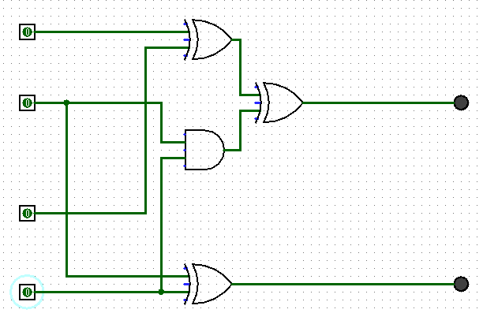
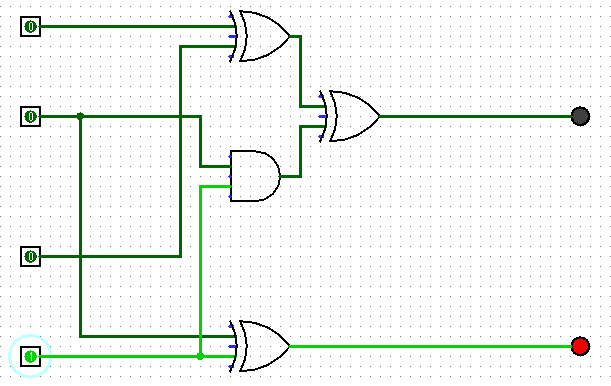
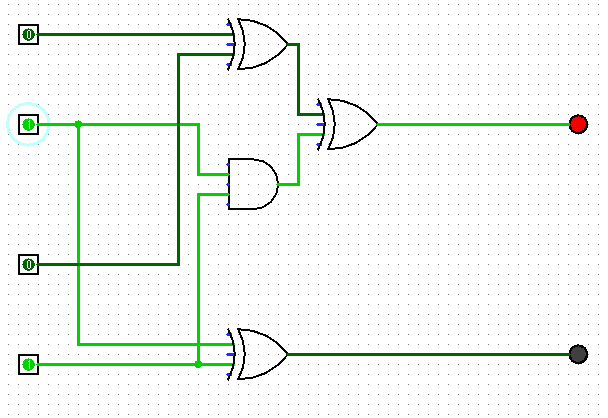
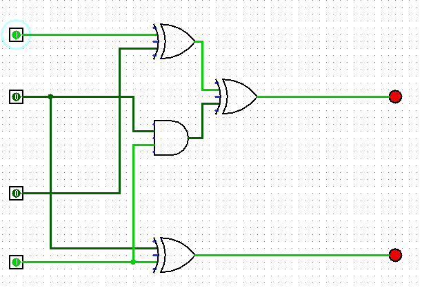
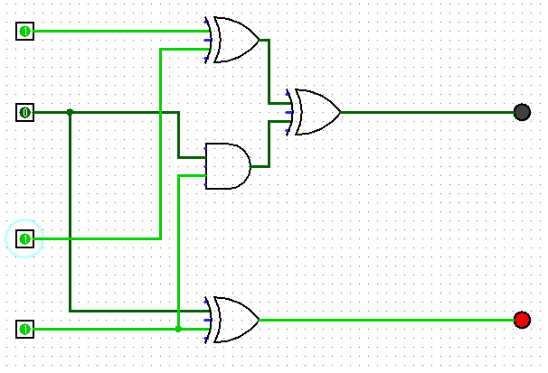
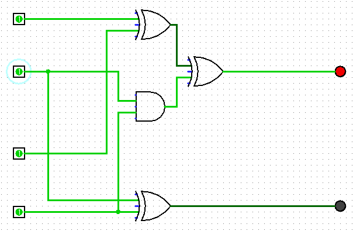

- Discussion Forum
  You are given two 2-bit binary inputs, A and B, and your task is to design a combinational logic circuit that performs the addition operation (A + B) and produces the 2-bit result C.  

  - 私はANDゲートとORゲートXORゲートを使用して、2ビットのバイナリ入力AとBの加算を行うコンビネーショナルロジック回路を設計しました。
  - ANDゲートは二つの入力の両方が1である場合にのみ出力が1になるため、桁上がりを検出するために使用されます。ORゲートは二つの入力のどちらかが1である場合に出力が1になる。XORゲートは二つの入力のどちらか一方が1である場合に出力が1になるため、加算の結果を生成するために使用されます。
  - 目標とした真理値表は以下の通りです。
| A1 | A0 | B1 | B0 | C1 | C0 |
|----|----|----|----|----|----|
| 0  | 0  | 0  | 0  | 0  | 0  |
| 0  | 0  | 0  | 1  | 0  | 1  |
| 0  | 0  | 1  | 0  | 1  | 0  |
| 0  | 0  | 1  | 1  | 1  | 1  |
| 0  | 1  | 0  | 0  | 0  | 1  |
| 0  | 1  | 0  | 1  | 1  | 0  |
| 0  | 1  | 1  | 0  | 1  | 1  |
| 0  | 1  | 1  | 1  | 0  | 0  |
| 1  | 0  | 0  | 0  | 1  | 0  |
| 1  | 0  | 0  | 1  | 1  | 1  |
| 1  | 0  | 1  | 0  | 0  | 0  |
| 1  | 0  | 1  | 1  | 0  | 1  |
| 1  | 1  | 0  | 0  | 1  | 1  |
| 1  | 1  | 0  | 1  | 0  | 0  |
| 1  | 1  | 1  | 0  | 0  | 1  |
| 1  | 1  | 1  | 1  | 1  | 0  |
  - 
  - 今回設計したロジックゲートは下記になります
  - 
入力は2ビットのバイナリ値AとBで、出力は2ビットの結果Cで出力はLEDの点滅で表しています。
LEDの点滅はライトが点滅していれば１、点滅していなければ０を表しています。
  - 入力は上からA1, A0, B1, B0の順に並んでいます。
  - Cの1の位の値は入力の0の位と1の位の両方を考慮して計算されます。0の位でもし繰上りが発生した場合、Cの1の位に影響を与えます。
  - AとBの1の位は, 0の位と同様にXORゲートを通じてCの1の位を生成します。その後、AとBの0の位で繰上りが発生した場合、の考慮をANDゲートとXORゲートを使用して行います。
  - ANDはAとBの入力に対して繰上りが発生するかどうかを判断し、XORはCの1の位に繰上りが影響するかどうかを判断します。
  - 具体的な計算結果は下記の通りです。
  - 01 + 00 = 01
  - 
  - Cの0の位は0と1がインプットになるため、1になるべきであり、Cの1の位は0の位からの繰上りもなく、1の位のインプットも0であるため、0になる。
  - 01 + 01 = 10
  - 
  - インプットの0の値が両方共1であるため、出力の0の位は0になり、繰上りが発生し1の位は1になる。
  - 01 + 10 = 11
  - 
  - 桁上がりは発生せず、0の位と1の位の1がそのまま出力の0の位と1の位に影響を与える。
  - 01 + 11 = 01
  - 
  - 1の位は桁上がりが発生し、1の位は0になる。0の位は1のみが影響を与えるため、そのまま1になる。
  - 11 + 11 = 10
  - 
  - 0と1の位両方で桁上がりが発生する。0の位の桁上がりは1の位に影響を与え、1の位は1になる。1の位の桁上がりは2の位に影響を与えるが、今回は2の位は出力に含まれないため、0になる。
  
I have designed a combinational logic circuit using AND gates, OR gates, and XOR gates to perform the addition of two-bit binary inputs A and B.
An AND gate is used to detect carries since its output is 1 only if both of its two inputs are 1. An OR gate has an output of 1 if either of its two inputs is 1. An XOR gate is used to generate the result of an addition since its output is 1 if either of its two inputs is 1.
The target truth table is as follows:

| A1 | A0 | B1 | B0 | C1 | C0 |
|----|----|----|----|----|----|
| 0  | 0  | 0  | 0  | 0  | 0  |
| 0  | 0  | 0  | 1  | 0  | 1  |
| 0  | 0  | 1  | 0  | 1  | 0  |
| 0  | 0  | 1  | 1  | 1  | 1  |
| 0  | 1  | 0  | 0  | 0  | 1  |
| 0  | 1  | 0  | 1  | 1  | 0  |
| 0  | 1  | 1  | 0  | 1  | 1  |
| 0  | 1  | 1  | 1  | 0  | 0  |
| 1  | 0  | 0  | 0  | 1  | 0  |
| 1  | 0  | 0  | 1  | 1  | 1  |
| 1  | 0  | 1  | 0  | 0  | 0  |
| 1  | 0  | 1  | 1  | 0  | 1  |
| 1  | 1  | 0  | 0  | 1  | 1  |
| 1  | 1  | 0  | 1  | 0  | 0  |
| 1  | 1  | 1  | 0  | 0  | 1  |
| 1  | 1  | 1  | 1  | 1  | 0  |

The logic gate I designed this tasks is as follows:

The input is a 2-bit binary value, A and B, and the output is a 2-bit result, C, which is represented by a blinking LED.
The blinking LED represents a 1 if the light is blinking, and a 0 if it is not blinking.
The inputs are arranged in the order A1, A0, B1, B0 from top to bottom.
The value of the ones digit of C is calculated taking into account both the zeros digit and the ones digit of the input. If a carry occurs in the zeros digit, it will affect the ones digit of C.

The ones digits of A and B are passed through an XOR gate to generate the ones digit of C, just like the zeros digit. After that, if a carry occurs in the zeros digits of A and B, the AND and XOR gates are used to take this into account.
AND determines whether a carry will occur for the inputs of A and B, and XOR determines whether the carry will affect the ones digit of C.

The specific calculation results are as follows:
- 01 + 00 = 01

The zeros digit of C should be 1 since the input is 0 and 1, and the ones digit is 0 because there is no carry from the zeros digit, and the input for the ones digit is also 0.
- 01 + 01 = 10

The zeros digit of the input is 1 for both inputs, so the output's zeros digit is 0, and a carry occurs, making the ones digit 1.
- 01 + 10 = 11

The carry does not occur, and the 1s digit of the input directly affects the 0s digit and 1s digit of the output.
- 01 + 11 = 01

The ones digit has a carry, and the ones digit is 0. The zeros digit remains 1 because it is only affected by the 1 in the input.
- 11 + 11 = 10

Both the zeros digit and the ones digit have carries. The carry from the zeros digit affects the ones digit, making it 1, while the ones digit's carry affects the tens digit, which is not included in the output, resulting in 0.

- Question:
According to Ndjountche, T's text, all logic gates can be implemented with NAND. Can you explain how to implement AND, OR, and XOR gates using NAND gates? Also, what are the advantages of using NAND gates?

- Assignment
- Quiz