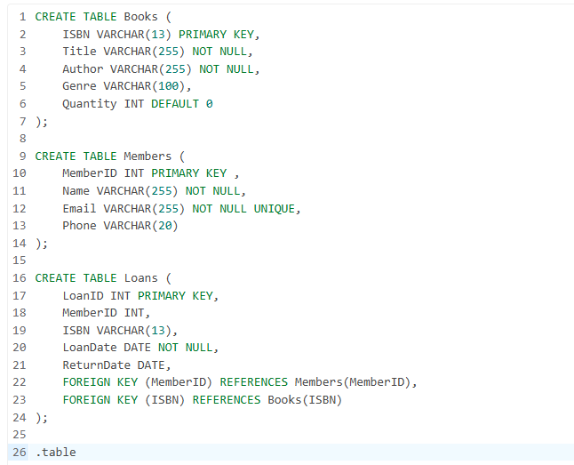
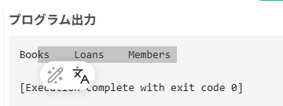
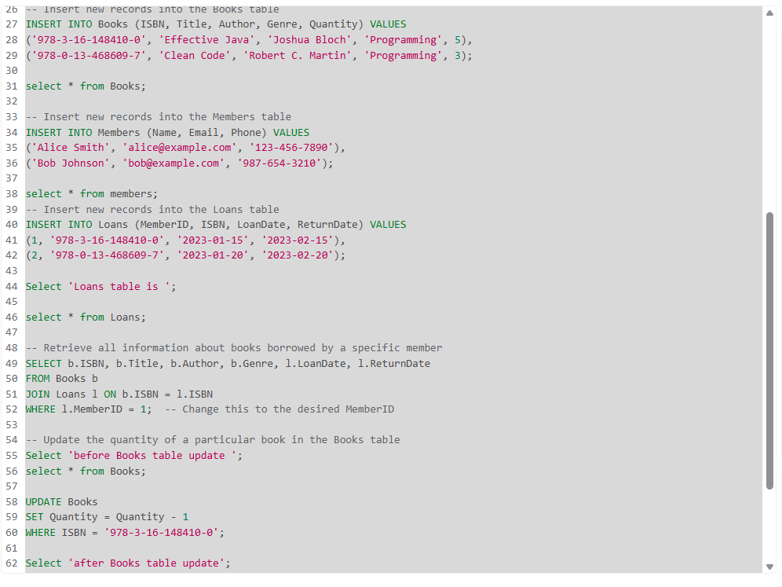
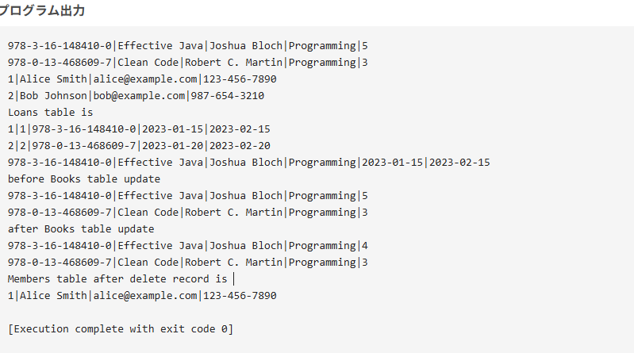

Discussions:
Imagine you are tasked with designing a database system for a university. As part of this project, you need to create tables to store student information. Considering your knowledge of SQL data types and language constructs:

Discuss which SQL data types you would use for storing student names, ages, and grades. Justify your choices based on the characteristics of each data type and the requirements of the university database.
Using SQL language constructs, outline a query to retrieve the names and ages of all enrolled students in a specific course, for e.g. Computer Science 101. Explain the components of your query and how each contributes to retrieving the desired information effectively.
End your discussion post with one question related to the concepts learned in this unit from which your colleagues can formulate a response or generate further discussion.
### Answers:
1. When designing a database system for a university, I would choose the following SQL data types for storing student information:
   - **Student Names**: I would use the `VARCHAR` data type. This is because student names can vary in length and may include spaces, special characters, and different alphabets. `VARCHAR` allows for variable-length strings, which is efficient for storage and provides flexibility.
   - **Ages**: I would use the `INT` data type. Since age is a whole number, `INT` is appropriate for storing this information. It allows for efficient arithmetic operations if needed, such as calculating average age or age distribution.
   - **Grades**: I would use the `DECIMAL` data type. Grades can be represented as decimal numbers (e.g., 3.5, 4.0) and may require precision for calculations like GPA. `DECIMAL` allows for fixed-point representation, which is suitable for financial and academic calculations.
   
2. Here is an example SQL query to retrieve the names and ages of all enrolled students in a specific course, such as "Computer Science 101":
```sql
SELECT ALL s.name, s.age
FROM students s
WHERE s.class = 'Computer Science 101';
```
   - **SELECT ALL s.name, s.age**: This part of the query specifies the columns to retrieve, which are the student's name and age.
   - **FROM students s**: This indicates the primary table from which to retrieve data, using an alias `s` for easier reference.
   - **WHERE s.class = 'Computer Science 101'**: This filters the results to include only students enrolled in "Computer Science 101".
This query effectively retrieves the desired information by selecting specific columns and applying a condition to filter the results based on the course name.
This SQL is for one table. Normally, student information and class information are the data to be normalized, but this time, we created SQL that assumes retrieval from one table without normalizing the data.
### Discussion Questions
What are some situations where you might choose to use CHAR instead of VARCHAR?


### Programming Assignment Unit 4
Your task is to:

Create a database schema for managing a library system with the following entities:
Books (with attributes: ISBN, Title, Author, Genre, and Quantity)
Members (with attributes: MemberID, Name, Email, and Phone)
Loans (with attributes: LoanID, MemberID, ISBN, LoanDate, and ReturnDate)

Implement SQL queries to perform the following operations (Please provide screenshots displaying all records in the mentioned relations):
Insert new records into the Books, Members, and Loans tables.
Retrieve all information about books borrowed by a specific member.
Update the quantity of a particular book in the Books table.
Delete a member record from the Members table.

Document your SQL script with comments to explain the purpose of each statement and provide a brief overview of the database schema.

### Answer:
1. **Database Schema**:
```sql
CREATE TABLE Books (
    ISBN VARCHAR(13) PRIMARY KEY,
    Title VARCHAR(255) NOT NULL,
    Author VARCHAR(255) NOT NULL,
    Genre VARCHAR(100),
    Quantity INT DEFAULT 0
);

CREATE TABLE Members (
    MemberID INTEGER PRIMARY KEY AUTOINCREMENT,
    Name VARCHAR(255) NOT NULL,
    Email VARCHAR(255) NOT NULL UNIQUE,
    Phone VARCHAR(20)
);

CREATE TABLE Loans (
    LoanID INTEGER PRIMARY KEY AUTOINCREMENT,
    MemberID INT,
    ISBN VARCHAR(13),
    LoanDate DATE NOT NULL,
    ReturnDate DATE,
    FOREIGN KEY (MemberID) REFERENCES Members(MemberID),
    FOREIGN KEY (ISBN) REFERENCES Books(ISBN)
);
```

SQL script


output 


2. **SQL Queries**:
```sql

-- Insert new records into the Books table
INSERT INTO Books (ISBN, Title, Author, Genre, Quantity) VALUES
('978-3-16-148410-0', 'Effective Java', 'Joshua Bloch', 'Programming', 5),
('978-0-13-468609-7', 'Clean Code', 'Robert C. Martin', 'Programming', 3);

select * from Books;

-- Insert new records into the Members table
INSERT INTO Members (Name, Email, Phone) VALUES
('Alice Smith', 'alice@example.com', '123-456-7890'),
('Bob Johnson', 'bob@example.com', '987-654-3210');

select * from members;
-- Insert new records into the Loans table
INSERT INTO Loans (MemberID, ISBN, LoanDate, ReturnDate) VALUES
(1, '978-3-16-148410-0', '2023-01-15', '2023-02-15'),
(2, '978-0-13-468609-7', '2023-01-20', '2023-02-20');

Select 'Loans table is ';

select * from Loans;

-- Retrieve all information about books borrowed by a specific member
SELECT b.ISBN, b.Title, b.Author, b.Genre, l.LoanDate, l.ReturnDate
FROM Books b
JOIN Loans l ON b.ISBN = l.ISBN
WHERE l.MemberID = 1;  -- Change this to the desired MemberID

-- Update the quantity of a particular book in the Books table
Select 'before Books table update ';
select * from Books;

UPDATE Books
SET Quantity = Quantity - 1
WHERE ISBN = '978-3-16-148410-0'; 

Select 'after Books table update';
select * from Books;
-- Delete a member record from the Members table
DELETE FROM Members
WHERE MemberID = 2;  -- Change this to the desired MemberID

Select 'Members table after delete record is ';
select * from Members;
 
```
Above SQL script creates a library system with three tables: Books, Members, and Loans. It includes operations to insert new records, retrieve information about borrowed books, update book quantities, and delete member records. The comments in the script explain the purpose of each statement.
 

 

3. **Documentation**:
The database schema consists of three tables: 
Books, Members, and Loans. The Books table stores information about each book, including its ISBN, title, author, genre, and quantity available. The Members table contains details about library members, such as their ID, name, email, and phone number. The Loans table tracks which books are borrowed by which members, including the loan date and return date.
Table is classified by the grouping of the data. 
This time, I organized the data into three types: books, customers, and loans, and defined each as a table. Since the book records have an ISBN, which is an ID that identifies the book in the real world, I also set this as the primary key in the database.
Script execution results show the successful creation of tables and the insertion of records. The queries demonstrate how to retrieve information about borrowed books, update book quantities, and delete member records.