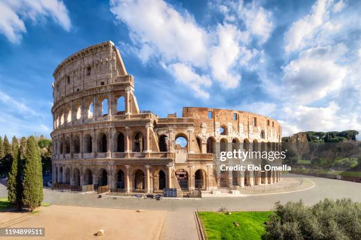

## Assignment Activity

- Scenario:
1. HTML Exercises
Homepage: Interactive Number Blocks, Lists
Create a homepage that displays numbers 1 - 4, each with a different background color. On clicking any number, it should jump to a nested list to display travel destinations (e.g., Europe – France, Italy, Greece - Ordered list) and subcategories (e.g., Paris, Rome, Athens - Unordered list). Similarly for other numbers.

Example: When you click 1, the output should resemble the figure shown below.

A screenshot of a travel blog website that displays numbers 1 to 4 each with a different background color. 

Likewise, for the remaining number groups:

On Clicking Block	Continent	Country with cities
2	Asia	Japan with cities- Tokyo, Kyoto, Osaka.
China with cities – Beijing, Shanghai, Xi'an.
India with cities - New Delhi, Mumbai, Jaipur.
3	America	USA - New York City, Los Angeles, Chicago
Brazil - Rio de Janeiro, São Paulo, Salvador
Canada – Toronto, Vancouver, Montreal
4	Africa	South Africa – Cape Town, Johannesburg, Durban
Egypt – Cairo, Luxor, Sharm El Sheikh
Morocco – Marrakech, Casablanca, Fez


Travel Stories: Table Creation, Image linking, Jump to Section
Create a table that lists 3 travel destinations in left column and images of associated attractions in right column (e.g., Paris- Eiffel tower, Rome- Colosseum, New York- Statue of Liberty). On clicking the attraction, it should jump to bottom of the page with related information.

Example of table with travel destinations with corresponding images is illustrated below:

A screenshot shows "Travel Destinations" with a table listing 3 destinations. The Paris row features the Eiffel Tower image.


2. CSS Exercises
Homepage Styling: Colorful Numbers, Nested Lists Styling
Style the number blocks with hover effects. Style the nested lists to make them visually distinct by using different color for headings and subheadings.

Travel Stories: Image and Table Styling
Style the photo gallery images with hover effects that change the image opacity.
Style the table with colorful borders, alternating row colors, bold headers, and padding to make the table easy to read.

- Answer:
1. HTML Code for Homepage with Interactive Number Blocks and Nested Lists
```html
<!DOCTYPE html>
<html lang="en">
<head>
    <meta charset="UTF-8">
    <meta name="viewport" content="width=device-width, initial-scale=1.0">
    <title>Travel Blog</title>
    <link rel="stylesheet" href="styles.css">
</head>
<body>
    <section>
        <a href="#Europe">
            <svg width="200" height="100" viewBox="0 0 100 100" xmlns="http://www.w3.org/2000/svg">
                <circle cx="50" cy="50" r="45" stroke="red" stroke-width="5" fill="red"/>
                <text x="50%" y="50%" text-anchor="middle" font-size="30" fill="white">1</text>
            </svg> 
        </a>
        <a href="#Asia">
            <svg width="200" height="100" viewBox="0 0 100 100" xmlns="http://www.w3.org/2000/svg">
                <circle cx="50" cy="50" r="45" stroke="blue" stroke-width="5" fill="blue"/>
                <text x="50%" y="55%" text-anchor="middle" font-size="30" fill="white">2</text>
            </svg>
        </a>
        <a href="#America">
            <svg width="200" height="100" viewBox="0 0 100 100" xmlns="http://www.w3.org/2000/svg">
                <circle cx="50" cy="50" r="45" stroke="green" stroke-width="5" fill="green"/>
                <text x="50%" y="55%" text-anchor="middle" font-size="30" fill="white">3</text>
            </svg>
        </a>
        <a href="#Africa">
            <svg width="200" height="100" viewBox="0 0 100 100" xmlns="http://www.w3.org/2000/svg">
                <circle cx="50" cy="50" r="45" stroke="orange" stroke-width="5" fill="orange"/>
                <text x="50%" y="55%" text-anchor="middle" font-size="30" fill="white">4</text>
            </svg>
        </a>
    </section>

    <section id="Europe">
        <h2>Europe</h2>
        <ol>
            <li>France
                <ul>
                    <li>Paris</li>
                    <li>Lyon</li>
                    <li>Nice</li>
                </ul>
            </li>
            <li>Italy
                <ul>
                    <li>Rome</li>
                    <li>Venice</li>
                    <li>Milan</li>
                </ul>
            </li>
            <li>Greece
                <ul>
                    <li>Athens</li>
                    <li>Thessaloniki</li>
                    <li>Crete</li>
                </ul>
            </li>
        </ol>
    </section>
    <section id="Asia">
        <h2>Asia</h2>
        <ol>
            <li>Japan
                <ul>
                    <li>Tokyo</li>
                    <li>Kyoto</li>
                    <li>Osaka</li>
                </ul>
            </li>
            <li>China
                <ul>
                    <li>Beijing</li>
                    <li>Shanghai</li>
                    <li>Xi'an</li>
                </ul>
            </li>
            <li>India
                <ul>
                    <li>New Delhi</li>
                    <li>Mumbai</li>
                    <li>Jaipur</li>
                </ul>
            </li>
        </ol>
    </section>
    <section id="America">
        <h2>America</h2>
        <ol>
            <li>USA
                <ul>
                    <li>New York City</li>
                    <li>Los Angeles</li>
                    <li>Chicago</li>
                </ul>
            </li>
            <li>Brazil
                <ul>
                    <li>Rio de Janeiro</li>
                    <li>São Paulo</li>
                    <li>Salvador</li>
                </ul>
            </li>
            <li>Canada
                <ul>
                    <li>Toronto</li>
                    <li>Vancouver</li>
                    <li>Montreal</li>
                </ul>
            </li>
        </ol>
    </section>
    <section id="Africa">
        <h2>Africa</h2>
        <ol>
            <li>South Africa
                <ul>
                    <li>Cape Town</li>
                    <li>Johannesburg</li>
                    <li>Durban</li>
                </ul>
            </li>
            <li>Egypt
                <ul>
                    <li>Cairo</li>
                    <li>Luxor</li>
                    <li>Sharm El Sheikh</li>
                </ul>
            </li>
            <li>Morocco
                <ul>
                    <li>Marrakech</li>
                    <li>Casablanca</li>
                    <li>Fez</li>
                </ul>
            </li>
        </ol>
    </section>
    <section>
        <h2>Travel Destinations</h2>
        <table>
            <tr>
                <th>Destination</th>
                <th>Attraction</th>
            </tr>
            <tr>
                <td>Paris</td>
                <td><a href="#EiffelTower"></a></td>
            </tr>
            <tr>
                <td>Rome</td>
                <td><a href="#Colosseum"></a></td>
            </tr>
            <tr>
                <td>New York</td>
                <td><a href="#StatueOfLiberty"></a></td>
            </tr>
        </table>
    </section>

    <section id="EiffelTower">
        <h2>Eiffel Tower</h2>
        <p>The Eiffel Tower is one of the most iconic landmarks in Paris, France. It was constructed in 1889 and stands at a height of 324 meters. Visitors can enjoy panoramic views of the city from its observation decks.</p>
    </section>
    <section id="Colosseum">
        <h2>Colosseum</h2>
        <p>The Colosseum is an ancient amphitheater located in the center of Rome, Italy. It was completed in AD 80 and could hold up to 80,000 spectators. It is famous for its gladiatorial contests and public spectacles.</p>
    </section>
    <section id="StatueOfLiberty">
        <h2>Statue of Liberty</h2>
        <p>The Statue of Liberty is a colossal statue located on Liberty Island in New York Harbor, USA. It was a gift from France to the United States and was dedicated on October 28, 1886. The statue symbolizes freedom and democracy.</p>
    </section>
</body>
</html>
```
2. CSS Code for Styling the Homepage and Travel Stories
```css
body {
    font-family: Arial, sans-serif;
    margin: 20px;
}
section {
    margin-bottom: 40px;
}
a {
    text-decoration: none;
}
a:hover {
    opacity: 0.8;
}
svg {
    margin: 10px;
    cursor: pointer;
}
svg:hover {
    transform: scale(1.1);
    transition: transform 0.3s;
}
h2 {
    color: #333;
}
ol, ul {
    margin-left: 20px;
}
table {
    width: 100%;
    border-collapse: collapse;
}
th, td {
    border: 1px solid #ddd;
    padding: 8px;
    text-align: left;
}
th {
    background-color: #f2f2f2;
    font-weight: bold;
}
tr:nth-child(even) {
    background-color: #f9f9f9;
}
img {
    border: 2px solid #ddd;
    border-radius: 4px;
    padding: 5px;
}
img:hover {
    opacity: 0.7;
    transition: opacity 0.3s;
}
```

- Description:
1. The HTML code creates a travel blog homepage with interactive number blocks representing different continents. Each block links to a section with nested lists of countries and cities. Additionally, a table lists travel destinations with images that link to detailed information about each attraction.
In this code, severals tags are used:
- `<a>`: Defines hyperlinks to different sections of the page.
- `<svg>`: Used to create scalable vector graphics for the number blocks.
- `<circle>`: Draws circles within the SVG elements.
- `<text>`: Adds text inside the SVG circles.
- `<section>`: Defines sections of the webpage for better organization.
- `<h2>`: Represents headings for each section.
- `<ol>` and `<ul>`: Create ordered and unordered lists for countries and cities.
- `<li>`: Defines list items within the ordered and unordered lists.
- `<table>`, `<tr>`, `<th>`, and `<td>`: Create a table to display travel destinations and their corresponding images.
1. The CSS code styles the homepage and travel stories, adding hover effects to the number blocks and images, as well as styling the table for better readability. The use of colors, padding, and borders enhances the visual appeal of the content.