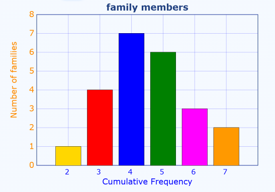

Question:
Question 1  

a. How would you describe the terms statistics, probability, population, and sample to someone who is unfamiliar with data analysis? Use a real-life scenario from real-world experience, such as understanding customer preferences at a local café.
b. How does simple random sampling differ from stratified sampling? Provide an example to explain the difference.

Question 2

The table below displays the distribution of family members across various households in a small rural area. 

| Number of Members | Number of Families |
|-------------------|--------------------|
| 2                 | 1                  |
| 3                 | 4                  |
| 4                 | 7                  |
| 5                 | 6                  |
| 6                 | 3                  |
| 7                 | 2                  |

Use the information provided in the above table to answer the following: 

a.Create a dot plot with clear labeled axes and titles
b.Calculate the total number of families that have more than four members.

Question 3 

The table displays the cumulative frequency of hours spent studying by a group of students over the course of a week. 

| Hours Studied  | Cumulative Frequency |
|----------------|----------------------|
| 0 - 5          | 8                    |
| 0 - 10         | 18                    |
| 0 - 15         | 30                   |
| 0 - 20         | 45                   |
| 0 - 25         | 55                   |

Based on the table above, 

a. How many students spent between 10 and 15 hours studying? 
b.How many students spent less than 20 hours studying? 

Answer:
Question 1
a. **Statistics** is the science of collecting, analyzing, interpreting, presenting, and organizing data. It helps us understand and make sense of data in various fields, such as business, healthcare, and social sciences. For example, at a local café, statistics can be used to analyze customer preferences by collecting data on the most popular drinks ordered during different times of the day.
**Probability** is the measure of the likelihood that an event will occur. It quantifies uncertainty and helps us make predictions based on data. For instance, if a café owner knows that 70% of customers order coffee in the morning, they can use this probability to prepare enough coffee for the expected demand.
**Population** refers to the entire group of individuals or items that we want to study. In the café example, the population could be all the customers who visit the café in a month.
**Sample** is a subset of the population that is selected for analysis. It is used when it is impractical or impossible to study the entire population. For instance, the café owner might choose to survey 100 customers randomly to understand their preferences instead of asking every customer who visits the café.
b. **Simple random sampling** is a method where each member of the population has an equal chance of being selected. For example, if the café owner randomly selects 50 customers from their customer database to survey about their drink preferences, that would be simple random sampling. Difference from stratified sampling is that in stratified sampling, the population is divided into subgroups (strata) based on certain characteristics, and then random samples are taken from each stratum. For example, if the café owner divides customers into groups based on age (e.g., under 30, 30-50, over 50) and then randomly selects customers from each age group to ensure representation across different ages, that would be stratified sampling.

Question 2
a. A dot plot is a simple way to visualize the distribution of data points. Here is a dot plot based on the provided table:

b. To calculate the total number of families that have more than four members, we can sum the number of families for households with 5, 6, and 7 members. 
So, the total number of families with more than four members is:
6 (for 5 members) + 3 (for 6 members) + 2 (for 7 members) = 11 families.

Question 3
a. To find the number of students who spent between 10 and 15 hours studying, we can subtract the cumulative frequency for 10 hours from the cumulative frequency for 15 hours:

30 (cumulative frequency for 15 hours) - 18 (cumulative frequency for 10 hours) = 12 students.

b. To find the number of students who spent less than 20 hours studying, we can use the cumulative frequency for 20 hours:

45 (cumulative frequency for 20 hours)