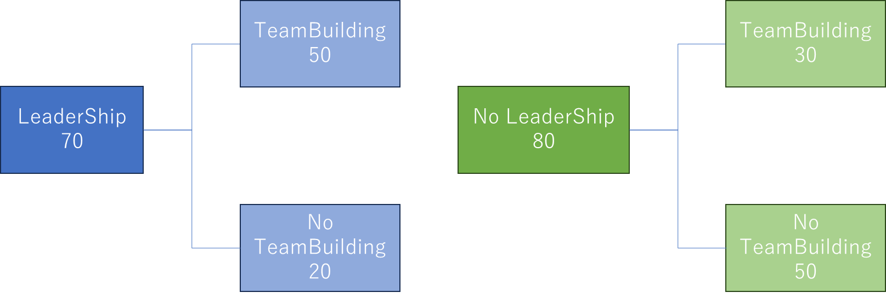

Question:

Activity 1
In this activity, the class is split into two groups, each tasked with analyzing a specific event. Group A examines, where outcomes from rolling a standard six-sided die are categorized as either even (2, 4, 6) or odd (1, 3, 5). Meanwhile, Group B explores, which involves flipping a coin, resulting in "Heads" or "Tails," followed by rolling a six-sided die with outcomes ranging from 1 to 6. 

Question 1 

Based on the described context above, define the following terms: 

Experiment 
Sample Space 
Event 
Outcome 
Probability 
Mutually exclusive events 
Independent events  
### Answers:
In this activity, Given a scenario, describe what each word represents.
1. **Experiment**: An experiment is a procedure or action that produces a set of outcomes. In this context, the experiments are rolling a die and flipping a coin.
2. **Sample Space**: The sample space is the set of all possible outcomes of an experiment. For Group A, the sample space when rolling a die is {1, 2, 3, 4, 5, 6}. For Group B, the sample space when flipping a coin and rolling a die is {(Heads, 1), (Heads, 2), (Heads, 3), (Heads, 4), (Heads, 5), (Heads, 6), (Tails, 1), (Tails, 2), (Tails, 3), (Tails, 4), (Tails, 5), (Tails, 6)}.
3. **Event**: An event is a specific outcome or a set of outcomes from an experiment. For Group A, an event could be rolling an even number (2, 4, 6). For Group B, an event could be flipping "Heads" and rolling a die that results in an even number.
4. **Outcome**: An outcome is a single result of an experiment. For Group A, an outcome could be rolling a 3. For Group B, an outcome could be flipping "Heads" and rolling a 4.
5. **Probability**: Probability is a measure of the likelihood of an event occurring, expressed as a number between 0 and 1. It is calculated as the number of favorable outcomes divided by the total number of possible outcomes. For example, the probability of rolling an even number in Group A is 3/6 = 0.5.
6. **Mutually Exclusive Events**: Mutually exclusive events are events that cannot occur at the same time. In Group A, rolling a 2 and rolling a 3 are mutually exclusive events because you cannot roll both at once. In Group B, flipping "Heads" and flipping "Tails" are mutually exclusive events.
7. **Independent Events**: Independent events are events where the occurrence of one event does not affect the occurrence of another. In Group B, flipping a coin and rolling a die are independent events because the result of the coin flip does not influence the outcome of the die roll.

Activity 2

This activity conducted a survey involving 150 students to understand their participation in two workshops: Leadership (L) and Team Building (T). The survey results are organized and presented in the table provided below, summarizing how many students participated in each workshop, as well as any overlaps or exclusive participation for each activity. The results are summarized in the table below:

Workshops 

Leadership (L) 

No Leadership (L')

Total 

Team Building (T) 

50 

30 

80 

No Team Building (T') 

20 

50 

70 

Total 

70 

80 

150 

Question 2
a. Create a Venn Diagram to represent relationships between participation in Leadership and Team Building. 

b. Draw a tree diagram and show all the participation probabilities clearly. 

Probability of participating in Leadership (L) = 70/150 = 0.4667
Probability of not participating in Leadership (L') = 80/150 = 0.5333
Probability of participating in Team Building (T) = 80/150 = 0.5333
Probability of not participating in Team Building (T') = 70/150 = 0.4667

Combination Probabilities:
- Probability of participating in both Leadership and Team Building (L ∩ T) = 50/150 = 0.3333
- Probability of participating in Leadership but not Team Building (L ∩ T') = 20/150 = 0.1333
- Probability of participating in Team Building but not Leadership (L' ∩ T) = 30/150 = 0.2
- Probability of not participating in either Leadership or Team Building (L' ∩ T') = 50/150 = 0.3333

Activity 3

Students are given a box that contains 8 green balls and 4 yellow balls to solve two probability-based problems. In the first case, CASE 1, they are asked to draw a green ball followed by a yellow ball when the balls are replaced after each draw. In the second case, CASE 2, they need to draw a green ball followed by a yellow ball, but without replacing the balls between the draws. 

Question 3 

Based on the described context above, 

Calculate the probability of CASE 1.  
Calculate the probability of CASE 2.  
### Answers:
1. **Probability of CASE 1 (with replacement)**:
   - The probability of drawing a green ball first: 
     - P(Green) = Number of Green Balls / Total Balls = 8 / (8 + 4) = 8 / 12 = 2 / 3
   - The probability of drawing a yellow ball second (after replacing the first):
     - P(Yellow) = Number of Yellow Balls / Total Balls = 4 / (8 + 4) = 4 / 12 = 1 / 3
   - Therefore, the combined probability for CASE 1:
     - P(Green then Yellow) = P(Green) * P(Yellow) = (2/3) * (1/3) = 2/9
2. **Probability of CASE 2 (without replacement)**:
   - The probability of drawing a green ball first:
     - P(Green) = Number of Green Balls / Total Balls = 8 / (8 + 4) = 8 / 12 = 2 / 3
     - After drawing a green ball, there are now 7 green balls and 4 yellow balls left.
   - The probability of drawing a yellow ball second (without replacement):
     - P(Yellow) = Number of Yellow Balls / Remaining Total Balls = 4 / (7 + 4) = 4 / 11
   - Therefore, the combined probability for CASE 2:
     - P(Green then Yellow) = P(Green) * P(Yellow) = (2/3) * (4/11) = 8/33